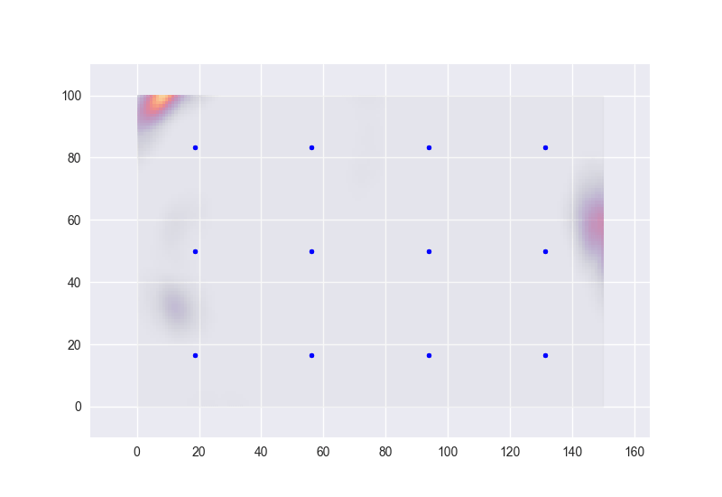

# Sigsen: Bayesian modelling of signal source locations

Sigsen is a python package that demonstrates how Bayesian methods can be used to model and located the source of various types of signals.

[An explanation and example code can be found here.](examples/example.ipynb)

